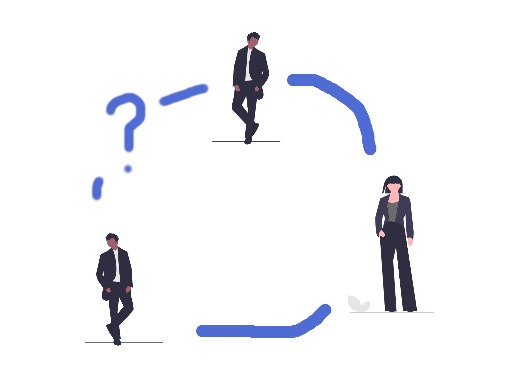
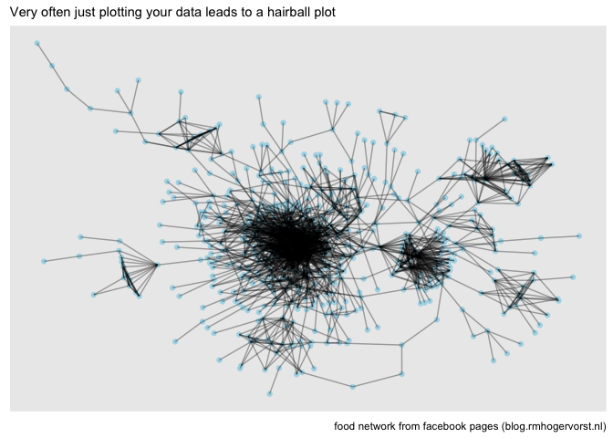
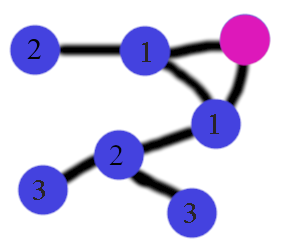

Rectangling (social) network data
================

Many things in the world are graphs, for instance real-life friendships,
business interactions, links between webpages and social networks. I
find graphs (the formal name for networks) fascinating and they are a
secret obsession of me. I was introduced to the concepts and
possibilities of those graphs during my data-science traineeship and
I’ve been interested since then.

I am also interested in machine learning and so the natural question
becomes, how can we do machine learning on graph data? We can predict
new connections between entities in the graph! Let us focus on a ‘real’
example: can we predict new connections between people (in other words;
can we do a friend recommendation for users?). I’ve been told by network
professionals that a very simple strategy is closing triangles: if you
and barry are friends and I’m also friends with Barry, recommending you
to me is often succesful.

Let’s say you work in a social media company and your boss asks you to
create a model to predict who will be friends, so you can feed those
recommendations back to the website and serve those to users.

This is part 1 of a [series about graphs and machine
learning](README.md).

**In this part we will rectangle graph (e.g. network) data into a format
that can be used for machine learning.**

In this post we will

-   load flat data into a graph format
-   finding connections to predict for (positive examples)
-   finding non connections (negative examples)
-   create features to use later in machine learning
-   create a dataset (with features and positive and negative examples)

## About networks

What you need to know about networks is that they consist of nodes nodes
(also called vertices) and connections between them: edges (also called
links).

Let’s make this a practical example: You (node) and I(node) are friends
(edge), you have another friend (node), let’s call him Barry. Maybe we
can learn something about you and I to see if I am likely to be a friend
with Barry too (prediction).



# Problem

The problem is that most machine learning assumes a rectangular
structure a ‘tidy’ structure: with one case per row and different
metrics for that case in a column each:

    id | measure 1 | measure 2 | outcome
    123| 2         |  2        | 1
    124| 3         |  2        | 0

But network data is graph data and graph data is usually not saved in
that format.

### Input data

There are many ways to store network data, but I’ve seen a lot of
datasets where the data is split into a file with connections (edgelist)
and a file with information about the nodes. In this case we start with

-   an edgelist (connecting id to id) (there are no headings in this
    file)

<!-- -->

    1,    611
    2,    265
    2,    182

-   and a node information file (nothing more than name and id here)
    (there are headings in this file)

<!-- -->

    id,               name,                           new_id
    402449106435352,  Josh Marks,                     386
    368969274888,     Blue Ribbon Restaurants,        473
    765596333518863,  Pat Neely,                      1

We first have to assemble these two sources of information into a graph
and than flatten it into edge-information only.

### End goal:

This is the format I want the data to be in:

-   link between two vertices? 1=yes, 0 = no
-   which vertices are we talking about (So I can link it back later)
-   features about the nodes

<!-- -->

    id      | node 1 | node 2| features about node 1 and 2 ..... | link
    123-124 |  123   | 124   | ........                          | 1
    123-130 |  123   | 130   | ........                          | 1
    130-134 |  130   | 134   | ........                          | 1

# Assembling the data into a graph

## Data source

Data is from a clone of myspace with a focus on seeing each others
faces, let’s call it Spacebook[1]

You can download the data from
<http://networkrepository.com/fb-pages-food.php#> (I saved it into a
data/ folder in this directory)

## Packages and data loading

``` r
library(readr)      # for faster reading in (not necessary, but oh so nice)
library(dplyr)      # lovely data manipulation
library(tidygraph)  # for graph manipulation # this also loads igraph
library(ggraph)     # for graph visualisation # this also loads ggplot2
```

Load the data:

``` r
nodes <- readr::read_csv("data/fb-pages-food.nodes")
```

    ## 
    ## ── Column specification ────────────────────────────────────────────────────────
    ## cols(
    ##   id = col_double(),
    ##   name = col_character(),
    ##   new_id = col_double()
    ## )

``` r
edges <- readr::read_csv("data/fb-pages-food.edges",col_names = c("from","to"))
```

    ## 
    ## ── Column specification ────────────────────────────────────────────────────────
    ## cols(
    ##   from = col_double(),
    ##   to = col_double()
    ## )

``` r
range(nodes$new_id) # 0-619
```

    ## [1]   0 619

``` r
range(edges$from) # 0-618
```

    ## [1]   0 618

``` r
range(edges$to) # 15-619
```

    ## [1]  15 619

``` r
nodes %>% count(name, sort = TRUE) %>% head(8)
```

    ## # A tibble: 8 x 2
    ##   name               n
    ##   <chr>          <int>
    ## 1 McDonald's        59
    ## 2 KFC               27
    ## 3 Domino's Pizza    20
    ## 4 Nando's           15
    ## 5 Dunkin' Donuts    10
    ## 6 Jumia Food        10
    ## 7 foodpanda          8
    ## 8 Magnum             7

There are several problems with this data that I figured out over time.
ids start with 0 and igraph cannot handle that for some reason so we
have to add 1 to all ids, also id is an ID that refers to a bigger data
set so what we really want from this file is the new\_id. Furthermore
the names are not unique, for instance are 59 nodes with the name
McDonald’s and 10 with the name Jumia Food. Let’s make the node names
unique by concatenating the id to the name.

``` r
nodes_ <- nodes %>% 
  select(id = new_id, name) %>% 
  mutate(
    id = id +1,
    name=paste0(name," (",id,")")
    )
edges_ <- edges %>% 
  mutate(from= from+1, to=to+1)
g <-
  tidygraph::tbl_graph(
    edges=edges_,
    nodes = nodes_,
    directed = FALSE,
    node_key = "id" # It chooses the first one by default, so it should work, but let's be clear.
    )
g
```

    ## # A tbl_graph: 620 nodes and 2102 edges
    ## #
    ## # An undirected multigraph with 1 component
    ## #
    ## # Node Data: 620 x 2 (active)
    ##      id name                         
    ##   <dbl> <chr>                        
    ## 1   387 Josh Marks (387)             
    ## 2   474 Blue Ribbon Restaurants (474)
    ## 3     2 Pat Neely (2)                
    ## 4   543 La Griglia (543)             
    ## 5   190 Jose Garces (190)            
    ## 6   455 Zac Kara (455)               
    ## # … with 614 more rows
    ## #
    ## # Edge Data: 2,102 x 2
    ##    from    to
    ##   <int> <int>
    ## 1     1   277
    ## 2     1    59
    ## 3     1   133
    ## # … with 2,099 more rows

[{tidygraph}](https://cran.r-project.org/package=tidygraph) displays the
graph structure as 2 tibbles (data.frames) one for the edges, and one
for the nodes. This allows for a workflow where you can trigger edges or
nodes to work with and manipulate them with the
[{dplyr}](https://cran.r-project.org/package=dplyr) and
[{purrr}](https://cran.r-project.org/package=purrr) verbs.[2]

### A quick peek into the graph for now

``` r
ggraph(g)+
  geom_node_point(color = "lightblue")+
  geom_edge_link(alpha = 1/3)+
  labs(
    subtitle = "Very often just plotting your data leads to a hairball plot",
    caption="food network from facebook pages (blog.rmhogervorst.nl)"
    )
```

    ## Using `stress` as default layout

<!-- -->

# Creating negative and positive examples for machine learning

We want our model to predict possible links between edges. So what are
possible edges? If you and me are friends and Barry is a friend of yours
but not of me it is probable that Barry and me can become a friend. But
it is less likely that a friend of Barry or a friend further away
becomes friends with me. Not impossible but unlikely. As positive
examples we take edges that can be taken away without breaking the
network into pieces.

## Negative examples

So what do I select as negative examples? What are possible candidate
connections? I use nodes that are at distance 2 from each other.

In the (ugly) picture below, we count the number of steps from the pink
node to other nodes. We select all nodes at distance 2 as negative
examples.

 How do we find the distance of every
node to every other node? We create a distance matrix.

``` r
dist_g <- igraph::distances(g )
```

For reasons I do not yet know this matrix has the names of the vertices
and not the ids.

``` r
colnames(dist_g)[1:5]
```

    ## [1] "Josh Marks (387)"              "Blue Ribbon Restaurants (474)"
    ## [3] "Pat Neely (2)"                 "La Griglia (543)"             
    ## [5] "Jose Garces (190)"

``` r
rownames(dist_g)[1:5]
```

    ## [1] "Josh Marks (387)"              "Blue Ribbon Restaurants (474)"
    ## [3] "Pat Neely (2)"                 "La Griglia (543)"             
    ## [5] "Jose Garces (190)"

We could create a function that finds for every 2 in the matrix the row
and column name. But I’m going to cram the matrix into a data.frame and
re-attach the node ids back.

``` r
distances <- 
  reshape2::melt(dist_g, value.name = "distance") %>% 
  left_join(nodes_, by=c("Var1"="name")) %>% 
  rename(to=id) %>% 
  left_join(nodes_, by=c("Var2"="name")) %>% 
  rename(from=id) 

neg_examples <- 
  distances %>% 
  filter(distance ==2)
head(neg_examples)
```

    ##                                    Var1             Var2 distance  to from
    ## 1                     Andy Luotto (485) Josh Marks (387)        2 485  387
    ## 2                  Domino's Pizza (383) Josh Marks (387)        2 383  387
    ## 3                      McDonald's (165) Josh Marks (387)        2 165  387
    ## 4               Alex Guarnaschelli (57) Josh Marks (387)        2  57  387
    ## 5 McDonald's Deutschland Karriere (505) Josh Marks (387)        2 505  387
    ## 6                      McDonald's (336) Josh Marks (387)        2 336  387

## Positive examples

When we start with a rectangular dataset we often select a subset of the
data and keep that apart to predict on later, but in this case the
entire network is connected and cutting away random edges may result in
cutting the entire network into pieces, that changes the dynamics and
metrics extremely.

So let’s go through all edges and find out if we can remove an edge
without breaking the network into non-connected components. I set up a
function that loops through the current edges and tests if the graph is
still connected.

*This is not the most efficient function and so if you run this
interactively, I would advise to add the progress bar, by uncommenting
selected lines.*

``` r
find_possible_edges <- function(g, edges, seed=12445){
  ## for interactive use, uncomment progressbar lines.(one #)
  #library(progress)
  #pb <- progress_bar$new(total = nrow(edges))
  
  ## We gradually cut more edges in the graph, so it matters where your start
  ## but the loop goes from top to bottom, and therefore I randomize the order,
  ## a different seed will lead to slightly different results.
  set.seed(seed)
  idx <- sample(1:nrow(edges),size = nrow(edges),replace = FALSE)
  edges <- edges[idx,]
  ## Preallocate result (because growing a vector is slower)
  pos_examples_idx <- rep(FALSE, nrow(edges))
  g_temp <- g
  ## Go through edges one by one
  for (row in seq_len(nrow(edges))) {
    #pb$tick()
    
    ## remove one edge from the graph
    g_temp1 <- g_temp %>% 
      activate(edges) %>% 
      anti_join(edges[row,], by=c("from","to"))
    
    ## check if graph is still connected
    verdict <- with_graph(g_temp1, graph_is_connected())
    pos_examples_idx[row] <- verdict
    ## if positive, we continue with this graph in the next loop
    if(verdict){g_temp <- g_temp1}  
  }
  message(paste0("Found ",sum(pos_examples_idx), " possible links"))
  ## Return positive examples only
  edges[pos_examples_idx,] 
}
```

Run the function on the edges.

``` r
system.time(
  # just to show you how slow this process is.
  {pos_examples <- find_possible_edges(g, edges_)}
)
```

    ## Found 1617 possible links

    ##    user  system elapsed 
    ##  17.165   0.536  24.817

This leads to many more negative examples than positive examples:

``` r
cat(paste0("There are ",nrow(pos_examples), " positive examples and ",
       nrow(neg_examples), " negative examples.",
       "\nThere are ~",round(nrow(neg_examples)/nrow(pos_examples)), " more negative examples than positive."))
```

    ## There are 1617 positive examples and 34306 negative examples.
    ## There are ~21 more negative examples than positive.

# Turn positive and negative examples into a dataset with features.

## Combining positive and negative examples

``` r
# make positive 1 and negative 0
# We should probably remove some duplciates here. because the graph is undirected a link between A-B and B-A is identical. and we can remove one of those. 
trainingset <- 
  bind_rows(
    pos_examples %>% 
      filter(from != to) %>% 
      mutate(target=1),
    neg_examples[,c("from","to")] %>%
      filter(from != to) %>% 
      mutate(target=0)
)
```

To calculate graph information, we shouldn’t calculate them on the graph
where the positive examples are already connected. That would not
generalize to new cases. and that is what we are making this model for.

``` r
emptier_graph <- g %>% 
  activate(edges) %>% 
  anti_join(pos_examples, by = c("from", "to"))
# make sure we didn't do something stupid
stopifnot(with_graph(emptier_graph, graph_is_connected()))
```

## Create features for every node

Calculate some features about every node in the graph.

communities closeness N-common neighbors. unique neighbors

``` r
nodes_igraph <- igraph::V(emptier_graph) # should work the same, but isn't true.
# it seems igraph uses different node ids so we have to work around this...
ids <- names(nodes_igraph) %>% gsub(".+\\(([0-9]+)\\)$","\\1",x=.) %>% as.numeric()

neighbors <- igraph::neighborhood(emptier_graph,order = 1)
neighbors_dist2 <- igraph::neighborhood(emptier_graph,order = 2,mindist = 1)

lookup_vertice_id <- function(empty_graph_id){
  which(ids == empty_graph_id)
}
# 285   546
# 151 614
# 8 584
n_common_neighbors <- function(from, to){
  stopifnot(from != to) # I know myself, and protect against me
  from_id <- lookup_vertice_id(as.integer(from))
  from_nb <- names(neighbors[[from_id]])
  from_itself <- names(nodes_igraph[[from_id]])
  from_nbs <- setdiff(from_nb, from_itself)
  to_id <- lookup_vertice_id(as.integer(to))
  to_nb <- names(neighbors[[to_id]])
  to_itself <- names(nodes_igraph[[to_id]])
  to_nbs <- base::setdiff(to_nb, to_itself)
  result <- base::intersect(from_nbs, to_nbs)
    if(is.null(result)){
      0
    }else{
      length(result)    
    }
}
n2_common_neighbors <- function(from, to){
  stopifnot(from != to) # I know myself, and protect against me
  from_id <- lookup_vertice_id(as.integer(from))
  from_nb <- names(neighbors_dist2[[from_id]])
  from_itself <- names(nodes_igraph[[from_id]])
  from_nbs <- setdiff(from_nb, from_itself)
  to_id <- lookup_vertice_id(as.integer(to))
  to_nb <- names(neighbors_dist2[[to_id]])
  to_itself <- names(nodes_igraph[[to_id]])
  to_nbs <- base::setdiff(to_nb, to_itself)
  result <- base::intersect(from_nbs, to_nbs)
  if(is.null(result)){
    0
  }else{
    length(result)    
  }
}
```

``` r
# superslow, because it is not vectorized.
get_common_neighbors <- function(dataframe){
  n1 <- rep(NA_integer_,nrow(trainingset))
n2 <- rep(NA_integer_,nrow(trainingset))
for (i in 1:nrow(trainingset)) {
  n1[[i]] <- n_common_neighbors(
    trainingset$from[[i]], trainingset$to[[i]]
    )
  n2[[i]] <- n2_common_neighbors(
    trainingset$from[[i]], trainingset$to[[i]]
    )
}
  dataframe$commonneighbors_1 = n1
  dataframe$commonneighbors_2 = n2
  dataframe
}


trainingset <- 
  trainingset %>% 
  get_common_neighbors()
```

``` r
node_features <- 
  emptier_graph %>% 
  activate(nodes) %>% 
  mutate(
    # to be honest, network people would know better what to do here than me.
    # what I do is not random, but it is an educated guess.
    degree= centrality_degree(normalized=FALSE),
    betweenness = centrality_betweenness(cutoff = 5,normalized = TRUE),#
    pg_rank = centrality_pagerank(),
    eigen = centrality_eigen(),
    closeness= centrality_closeness_generalised(0.5),
    br_score= node_bridging_score(), # takes quite long,
    coreness = node_coreness()
    ) %>% 
  as_tibble() %>% 
  select(-name)
```

## Combining feature information and trainingset

Merge this node information back into the trainingset. Right now there
will be columns for the left side of the edge and for the right side of
the edge. More advanced feature combinations can be made later.

``` r
enriched_trainingset <-
  trainingset %>% 
  left_join(node_features, by=c("from"="id")) %>% 
  left_join(node_features, by=c("to"="id"), suffix=c("","_to")) %>% 
  mutate(unique_neighbors = degree + degree_to - commonneighbors_1)
readr::write_rds(enriched_trainingset, file="data/enriched_trainingset.Rds")
```

# Conclusion

So that is how I would create a ‘rectangular’ dataset from graph data,
that can be used for machine learning.

So how would we use that in production setting?

-   First use an approach like this on your data and see if the features
    are good enough for prediction. (What is good enough? What are you
    doing now? How does that compare to ‘closing triangles’ approach?
    Are these features correlated with links?)
-   Add checks on input data pipeline so you can be sure your data set
    over time remains good. (test your assumptions, like uniqueness of
    names, distance between nodes, etc)
-   check performance in real world, how well do you predict real cases?
    Do you need to change some steps (probably yes).
-   set up a pipeline where you ingest data, train model, validate,
    predict on new data, and where your predictions are picked up by the
    front of the website to recommend to actual users.

## Notes

-   I created the ugly ‘people connected together’ picture by using
    icons from [undraw](https://undraw.co/)
-   This post was inspired by a nice python post about networks from
    [analyticsvidhya.com
    here](https://www.analyticsvidhya.com/blog/2020/01/link-prediction-how-to-predict-your-future-connections-on-facebook/),
    that post used the same data and positive and negative examples.
-   According to the data description: “Data collected about Facebook
    pages (November 2017). These datasets represent blue verified
    Facebook page networks of different categories. Nodes represent the
    pages and edges are mutual likes among them.” Ah, 2017, when I did
    not realize how awful the company facebook was. Blessed time…

## References

[1] yes, facebook started with easy importability from other networks
including myspace and is now blocking any attempts to do a similar
thing. We should force all companies to allow interoperability! I advise
you to read [Cory Docterow’s writing about adverserial interoperability
here](https://www.eff.org/deeplinks/2019/10/adversarial-interoperability).
alright I’m off my soapbox, let’s get back to networks

[2] This is a nice result of the power of tidy-flavor-packages in the
last 6 years, I wrote about it
[here](https://notes.rmhogervorst.nl/post/2020/11/16/good-software-design-constrains-users-but-can-give-freedom-too/)
