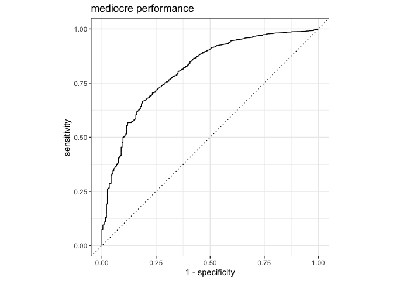

Link prediction
================

Many things in the world are graphs, for instance real-life friendships,
business interactions, links between webpages and social networks. I
find graphs (the formal name for networks) fascinating and they are a
secret obsession of me. I was introduced to the concepts and
possibilities of those graphs during my data-science traineeship and
I’ve been interested since then.

I am also interested in machine learning and so the natural question
becomes, how can we do machine learning on graph data?

This is part 2 of a [series about graphs and machine
learning](README.md).

**In this part I will build a simple model to predict links**

-   Using [{tidymodels}](https://cran.r-project.org/package=tidymodels)
    (a meta package that also loads {broom}, {recipes}, {dials},
    {rsample}, {dplyr}, {tibble}, {ggplot2}, {tidyr}, {infer}, {tune},
    {workflows}, {modeldata}, {parsnip}, {yardstick}, and {purrr})

# Loading packages and data

``` r
library(tidymodels)
```

    ## ── Attaching packages ────────────────────────────────────── tidymodels 0.1.1 ──

    ## ✓ broom     0.7.2      ✓ recipes   0.1.15
    ## ✓ dials     0.0.9      ✓ rsample   0.0.8 
    ## ✓ dplyr     1.0.2      ✓ tibble    3.0.4 
    ## ✓ ggplot2   3.3.2      ✓ tidyr     1.1.2 
    ## ✓ infer     0.5.3      ✓ tune      0.1.1 
    ## ✓ modeldata 0.1.0      ✓ workflows 0.2.1 
    ## ✓ parsnip   0.1.4      ✓ yardstick 0.0.7 
    ## ✓ purrr     0.3.4

    ## ── Conflicts ───────────────────────────────────────── tidymodels_conflicts() ──
    ## x purrr::discard() masks scales::discard()
    ## x dplyr::filter()  masks stats::filter()
    ## x dplyr::lag()     masks stats::lag()
    ## x recipes::step()  masks stats::step()

Load data

``` r
enriched_trainingset <- readr::read_rds(file="data/enriched_trainingset.Rds")
head(enriched_trainingset)
```

    ## # A tibble: 6 x 13
    ##    from    to target degree betweenness pg_rank    eigen br_score degree_to
    ##   <dbl> <dbl>  <dbl>  <dbl>       <dbl>   <dbl>    <dbl>    <dbl>     <dbl>
    ## 1   285   546      1      1           0 9.55e-4 2.01e- 5 0.000150         2
    ## 2   151   614      1      4          76 3.08e-3 5.10e-11 0.000364         2
    ## 3     8   584      1      1           0 8.62e-4 1.20e- 5 0.000168         3
    ## 4    68   435      1      1           0 9.96e-4 2.90e- 8 0.000120         1
    ## 5   345   378      1      1           0 9.01e-4 5.72e- 4 0.000183         1
    ## 6   223   366      1      1           0 8.34e-4 6.47e- 8 0.000167         2
    ## # … with 4 more variables: betweenness_to <dbl>, pg_rank_to <dbl>,
    ## #   eigen_to <dbl>, br_score_to <dbl>

THIS IS WHERE I WOULD SPEND A LOT OF TIME FIGURING OUT THE RELATIONSHIPS
BETWEEN OUTCOME AND FEATURES. LOTS OF PLOTS, LOTS OF CORRELATIONS ETC.

``` r
## usemodels is super easy to just format the basic needs for modeling! 
# usemodels::use_glmnet(enriched_trainingset, target~., verbose = FALSE, tune=FALSE, prefix = "ntwrk")
```

## Feature engineering

This is a set of steps to make sure we predict with only the features
that matter. Every row of this dataset is a ‘possible’ link (edge)
between two nodes. We know from both nodes the pagerank score, degree,
betweenness, eigen-centrality and bridge score. In an actual setting you
would know more than only network features, you could maybe see where
someone lives, history on the site, and many more features!

After some exploration (not showed here), I decided to create some
interactions between page rank of two nodes, and the degree of the
nodes, drop the identifiers to and from and make the target a factor.
Furthermore I drop correlated features and normalize and center all
features (there are no nominal variables in this dataset).

*This recipe is only a plan of action, nothing has happened yet.*

``` r
# make it very simple first.
ntwrk_recipe <-
  recipe(enriched_trainingset,formula = target~.) %>% 
  recipes::update_role(to, new_role = "other") %>% 
  recipes::update_role(from, new_role = "other") %>% 
  step_rm(starts_with("betweenness")) %>% 
  step_rm(starts_with("eigen")) %>% 
  step_rm(starts_with("br_score")) %>% 
  step_interact(terms = ~ pg_rank:pg_rank_to) %>% 
  step_interact(terms = ~ degree:degree_to) %>% 
  #step_corr(all_numeric()) %>% 
  #step_nzv(all_predictors()) %>% 
  step_normalize(all_predictors(), -all_nominal()) %>% 
  step_mutate(target = as.factor(target))
```

## model

So what are we going to do with the model? I’m using a logistic
regression from [{glmnet}](https://cran.r-project.org/package=glmnet)
and capture the steps of data preparation and modeling into 1
workflow-object.

``` r
ntwrk_spec <- 
  logistic_reg(penalty = tune(), mixture = 1) %>% # pure lasso
  set_engine("glmnet")

ntwrk_workflow <- 
  workflow() %>% 
  add_recipe(ntwrk_recipe) %>% 
  add_model(ntwrk_spec) 
```

## Train and test sets

I split the data into a test and train set, but making sure the
proportion of targets is the same in test and train data.

``` r
### split into training and test set
set.seed(2345)
tr_te_split <- initial_split(enriched_trainingset,strata = target)
val_set <- validation_split(training(tr_te_split),strata = target, prop = .8)
```

## Model tuning

I don’t know what the best penalty is for this model and data, so we
have to test different versions and choose the best one.

``` r
## Setting up tune grid manually, because it is just one column
lr_reg_grid <- tibble(penalty = 10^seq(-4, -1, length.out = 30))
```

``` r
ntwrk_res <-
  ntwrk_workflow %>% 
  tune_grid(val_set,
            grid = lr_reg_grid,
            control = control_grid(save_pred = TRUE),
            metrics = metric_set(roc_auc))
```

``` r
## visualise results
ntwrk_res %>% 
  collect_metrics() %>% 
  ggplot(aes(x = penalty, y = mean)) + 
  geom_point() + 
  geom_line() + 
  labs(
    title="Penalty should be lower than 0.01",
    y= "Area under the ROC Curve"
    ) +
  scale_x_log10(labels = scales::label_number())+
  geom_vline(xintercept = 0.01, color="tomato3")
```

<!-- -->
What are the best models

``` r
## show best models
top_models <-
  ntwrk_res %>% 
  show_best("roc_auc", n = 5) %>% 
  arrange(penalty)
lr_best <- 
  ntwrk_res %>% 
  collect_metrics() %>% 
  arrange(penalty) %>% 
  slice(5)

pred_auc <- 
  ntwrk_res %>% 
  collect_predictions(parameters = lr_best) %>% 
  roc_curve(target, .pred_0) %>% 
  mutate(model = "Logistic Regression")
autoplot(pred_auc)+ ggtitle("mediocre performance")
```

<!-- -->

It is not really that good.

Let’s use the best performing model and modify the current workflow, by
replacing the value

``` r
### replace model with parameters set (still untrained)
top_models[1,]
```

    ## # A tibble: 1 x 7
    ##   penalty .metric .estimator  mean     n std_err .config
    ##     <dbl> <chr>   <chr>      <dbl> <int>   <dbl> <chr>  
    ## 1  0.0001 roc_auc binary     0.632     1      NA Model01

``` r
ntwrk_spec_1 <- 
  logistic_reg(penalty = 0.003562248, mixture = 0.5) %>% 
  set_engine("glmnet")

## change model
updated_workflow <- 
  ntwrk_workflow %>% 
  update_model(ntwrk_spec_1)
```

HOW DOES IT PERFORM ON TEST DATA? THE DATA WE HELD OUT

Last fit is a special function from tune that fits data on the training
set and predicts on the testset.

``` r
ntwrk_fit <- 
  updated_workflow %>% 
  last_fit(tr_te_split)


ntwrk_fit %>% 
  collect_predictions() %>% 
  roc_curve(target, .pred_0) %>% 
  autoplot()+ 
  labs("Well, at least the test performance is equivalent to the training score")
```

<!-- -->

Unpacking predictions. Soo we always predicted no connection!

``` r
ntwrk_fit$.predictions[[1]] %>% 
  group_by(target, .pred_class) %>% 
  summarize(
    count = n(),
    avg_prob1 = mean(.pred_1),
    avg_prob0 = mean(.pred_0)
  )
```

    ## `summarise()` regrouping output by 'target' (override with `.groups` argument)

    ## # A tibble: 2 x 5
    ## # Groups:   target [2]
    ##   target .pred_class count avg_prob1 avg_prob0
    ##   <fct>  <fct>       <int>     <dbl>     <dbl>
    ## 1 0      0            8588    0.0455     0.955
    ## 2 1      0             392    0.0471     0.953

This is problematic.

# Undersampling for better performance.

``` r
# use specialized package for sampling methods.
# I'm now just undersampling, but you could create synthetic data too.
# 
library(themis) # install.packages("themis")
```

    ## Registered S3 methods overwritten by 'themis':
    ##   method                  from   
    ##   bake.step_downsample    recipes
    ##   bake.step_upsample      recipes
    ##   prep.step_downsample    recipes
    ##   prep.step_upsample      recipes
    ##   tidy.step_downsample    recipes
    ##   tidy.step_upsample      recipes
    ##   tunable.step_downsample recipes
    ##   tunable.step_upsample   recipes

    ## 
    ## Attaching package: 'themis'

    ## The following object is masked from 'package:tune':
    ## 
    ##     tunable

    ## The following objects are masked from 'package:recipes':
    ## 
    ##     step_downsample, step_upsample

``` r
ntwrk_recipe_undersample <-
  recipe(enriched_trainingset,formula = target~.) %>% 
  recipes::update_role(to, new_role = "other") %>% 
  recipes::update_role(from, new_role = "other") %>% 
  step_rm(starts_with("br_score")) %>% 
  step_interact(terms = ~ pg_rank:pg_rank_to) %>% 
  step_interact(terms = ~ degree:degree_to) %>% 
  step_interact(terms = ~ eigen:eigen_to) %>% 
  step_corr(all_predictors()) %>% 
  step_normalize(all_predictors(), -all_nominal()) %>% 
  step_mutate(target = as.factor(target)) %>% 
  step_downsample(target,under_ratio = 1.5)
```

``` r
ntwrk_spec2 <- 
  logistic_reg(penalty = tune(), mixture = tune()) %>% 
  set_engine("glmnet")

ntwrk_workflow2 <- 
  workflow() %>% 
  add_recipe(ntwrk_recipe_undersample) %>% 
  add_model(ntwrk_spec2) 

tune_grid <- grid_latin_hypercube(
  penalty(),
  mixture(), 
  size = 15
)
crossvalidation_sets <- vfold_cv(training(tr_te_split),v = 3, strata = target)
```

``` r
ntwrk_res2 <-
  ntwrk_workflow2 %>% 
  tune_grid(crossvalidation_sets,
            grid = tune_grid,
            control = control_grid(save_pred = TRUE),
            metrics = metric_set(roc_auc))
ntwrk_res2
```

    ## # Tuning results
    ## # 3-fold cross-validation using stratification 
    ## # A tibble: 3 x 5
    ##   splits           id    .metrics          .notes          .predictions         
    ##   <list>           <chr> <list>            <list>          <list>               
    ## 1 <split [18K/9K]> Fold1 <tibble [15 × 6]> <tibble [0 × 1… <tibble [134,715 × 7…
    ## 2 <split [18K/9K]> Fold2 <tibble [15 × 6]> <tibble [0 × 1… <tibble [134,715 × 7…
    ## 3 <split [18K/9K]> Fold3 <tibble [15 × 6]> <tibble [0 × 1… <tibble [134,715 × 7…

Visualise results

``` r
ntwrk_res2 %>% 
  collect_metrics() %>%
  select(mean, penalty:mixture) %>%
  pivot_longer(penalty:mixture,
               values_to = "value",
               names_to = "parameter"
  ) %>%
  ggplot(aes(value, mean, color = parameter)) +
  geom_point(alpha = 0.8, show.legend = FALSE) +
  facet_wrap(~parameter, scales = "free_x") +
  labs(x = NULL, y = "AUC")
```

<!-- -->

``` r
show_best(ntwrk_res2, "roc_auc")
```

    ## # A tibble: 5 x 8
    ##    penalty mixture .metric .estimator  mean     n std_err .config
    ##      <dbl>   <dbl> <chr>   <chr>      <dbl> <int>   <dbl> <chr>  
    ## 1 2.21e- 1   0.143 roc_auc binary     0.706     3 0.00770 Model03
    ## 2 1.47e- 2   0.976 roc_auc binary     0.705     3 0.00771 Model15
    ## 3 8.24e- 2   0.701 roc_auc binary     0.700     3 0.00396 Model11
    ## 4 2.41e- 3   0.606 roc_auc binary     0.693     3 0.00632 Model10
    ## 5 4.16e-10   0.927 roc_auc binary     0.688     3 0.00586 Model14

``` r
best_auc <- select_best(ntwrk_res2, "roc_auc")
```

``` r
final_workflow <- finalize_workflow(
  ntwrk_workflow2,
  best_auc
)
final_workflow
```

    ## ══ Workflow ════════════════════════════════════════════════════════════════════
    ## Preprocessor: Recipe
    ## Model: logistic_reg()
    ## 
    ## ── Preprocessor ────────────────────────────────────────────────────────────────
    ## 8 Recipe Steps
    ## 
    ## ● step_rm()
    ## ● step_interact()
    ## ● step_interact()
    ## ● step_interact()
    ## ● step_corr()
    ## ● step_normalize()
    ## ● step_mutate()
    ## ● step_downsample()
    ## 
    ## ── Model ───────────────────────────────────────────────────────────────────────
    ## Logistic Regression Model Specification (classification)
    ## 
    ## Main Arguments:
    ##   penalty = 0.220553905126207
    ##   mixture = 0.143439286357413
    ## 
    ## Computational engine: glmnet

``` r
library(vip)
```

    ## 
    ## Attaching package: 'vip'

    ## The following object is masked from 'package:utils':
    ## 
    ##     vi

``` r
final_workflow %>%
  fit(data = testing(tr_te_split)) %>%
  pull_workflow_fit() %>%
  vip(geom = "point")
```

<!-- -->

``` r
final_res <- last_fit(final_workflow, tr_te_split)
collect_metrics(final_res)
```

    ## # A tibble: 2 x 3
    ##   .metric  .estimator .estimate
    ##   <chr>    <chr>          <dbl>
    ## 1 accuracy binary         0.956
    ## 2 roc_auc  binary         0.714

``` r
final_res$.predictions[[1]] %>% 
  group_by(target, .pred_class) %>% 
  summarize(
    count = n(),
    avg_prob1 = mean(.pred_1),
    avg_prob0 = mean(.pred_0)
  )
```

    ## `summarise()` regrouping output by 'target' (override with `.groups` argument)

    ## # A tibble: 2 x 5
    ## # Groups:   target [2]
    ##   target .pred_class count avg_prob1 avg_prob0
    ##   <fct>  <fct>       <int>     <dbl>     <dbl>
    ## 1 0      0            8588     0.395     0.605
    ## 2 1      0             392     0.409     0.591

hahahaah even worse!

I still never predict 1.

    # NOW WE COULD BRING IT BACK AROUND AND PLOT PREDICTED VALUES
    # https://bgreenwell.github.io/pdp/articles/pdp-classification.html
    # * https://www.tidymodels.org/start/case-study/ for the model setup
    # * https://www.analyticsvidhya.com/blog/2020/01/link-prediction-how-to-predict-your-future-connections-on-facebook/ for the setup, choice of data and selection criteria
    # * network data facebook pages http://networkrepository.com/fb-pages-food.php#

## Notes

-   used this example from Julia Silge as template
    <https://juliasilge.com/blog/xgboost-tune-volleyball/>
